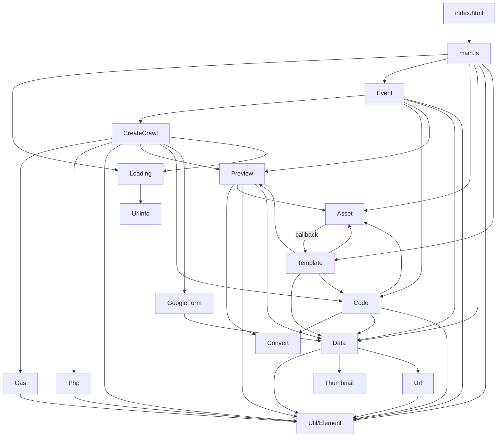

# srcフォルダ プログラムフロー図

## 概要
このドキュメントは、`src/js`フォルダ内のJavaScriptモジュールの依存関係とプログラムフローを示します。

## アーキテクチャ図



## モジュール一覧と役割

### コアモジュール

#### 1. main.js
- **役割**: アプリケーションのエントリーポイント
- **依存**: Event, Data, Util, Template, Loading, Asset
- **処理フロー**:
  1. DOMContentLoaded時に初期化
  2. Loadingインスタンス作成
  3. Eventインスタンス作成（イベントリスナー設定）
  4. Assetインスタンス作成（HTMLテンプレート読み込み）
  5. Templateインスタンス作成（コールバック）
  6. LocalStorageから設定を復元

#### 2. util.js (旧element.js統合)
- **役割**: DOM要素へのアクセスを提供するユーティリティクラス
- **依存**: なし
- **機能**:
  - インスタンスゲッター（amazon_url, create_button等）
  - 静的ゲッター（elm_button, elm_preview, elm_source等）
  - Element = Util（後方互換性エイリアス）

### データ管理モジュール

#### 3. data.js
- **役割**: アプリケーションデータの管理とLocalStorage操作
- **依存**: Util, Thumbnail, Url
- **機能**:
  - 商品データの保持と変換
  - サムネイル画像の生成
  - LocalStorageへの保存/読み込み
  - テンプレートの保存/読み込み

### イベント処理モジュール

#### 4. event.js
- **役割**: UIイベントハンドリング
- **依存**: Util, CreateCrawl, Data, Code, Preview
- **イベント**:
  - 画像サイズ変更（change_imagesize）
  - フォントサイズ変更（change_fontsize）
  - タグ入力（input_tag）
  - 作成ボタンクリック（click_create）
  - styleタグ除外チェック（set_except_style）

### クロール/API処理モジュール

#### 5. create_crawl.js
- **役割**: Amazon商品情報の取得処理を制御
- **依存**: Util, Preview, Data, Code, GoogleForm, Loading, Gas, Php
- **処理フロー**:
  1. URLバリデーション
  2. Loading状態をアクティブ化
  3. クロールエンジン選択（GAS or PHP）
  4. HTMLデータ取得
  5. データ変換
  6. Preview/Code更新
  7. GoogleFormへ送信

#### 6. crawl/gas.js
- **役割**: Google Apps Scriptを使用したクロール処理
- **依存**: Util
- **機能**:
  - GASエンドポイントへのリクエスト送信
  - レスポンスデータの取得

#### 7. crawl/php.js
- **役割**: PHPバックエンドを使用したクロール処理
- **依存**: Util
- **状態**: 未実装

### 表示/出力モジュール

#### 8. preview.js
- **役割**: プレビューエリアへのHTML表示
- **依存**: Asset, Convert, Util, Data
- **処理フロー**:
  1. プレビューエリアをクリア
  2. テンプレート取得（LocalStorage or デフォルト）
  3. テンプレート変数を商品データで置換
  4. プレビューエリアに表示

#### 9. code.js
- **役割**: ソースコードテキストエリアへのHTML出力
- **依存**: Asset, Convert, Data, Util
- **処理フロー**:
  1. ソースエリアをクリア
  2. テンプレート取得
  3. テンプレート変数を商品データで置換
  4. styleタグ除外処理（オプション）
  5. ソースエリアに表示

### ユーティリティモジュール

#### 10. template.js
- **役割**: HTMLテンプレートの管理
- **依存**: Data, Asset, Preview, Code
- **機能**:
  - テンプレート変更イベント処理
  - テンプレートリセット機能
  - LocalStorageへの保存

#### 11. convert.js
- **役割**: テンプレート文字列の変換処理
- **依存**: なし
- **機能**:
  - `{{key}}`形式のプレースホルダーを実データで置換
  - ネストされたオブジェクトキーのサポート（例: `{{data.price}}`）
  - JWT デコード機能

#### 12. url.js
- **役割**: URL操作とアフェリエイトタグ付加
- **依存**: なし
- **機能**:
  - アフェリエイトIDの付加
  - 相対パスから絶対URLへの変換
  - ホストルートの抽出

#### 13. thumbnail.js
- **役割**: Amazon画像URLのサイズ変換
- **依存**: なし
- **機能**:
  - 画像URLに`_AC_SX{size}_`パターンを挿入してサイズ変更

#### 14. asset.js
- **役割**: 外部HTMLテンプレートファイルの読み込み
- **依存**: なし
- **機能**:
  - `asset/sample.html`の非同期読み込み
  - 読み込み完了時のコールバック実行

### その他のモジュール

#### 15. google_form.js
- **役割**: Google Formへのデータ送信
- **依存**: Data
- **機能**:
  - フォームフィールドへのデータ設定
  - 自動送信

#### 16. loading/loading.js
- **役割**: ローディングインジケーターの表示制御
- **依存**: Urlinfo
- **機能**:
  - プログレスバーの表示/非表示
  - 処理時間の計測
  - 動的CSS読み込み

#### 17. loading/urlinfo.js
- **役割**: URLクエリパラメータの解析
- **依存**: なし

#### 18. create_api.js
- **役割**: Amazon Product Advertising API経由のデータ取得（代替実装）
- **依存**: Preview
- **状態**: 現在は使用されていない可能性あり

## 実行フロー

### 1. 初期化フロー
```
DOMContentLoaded
  ↓
Main.constructor()
  ↓
├─ new Loading() ────→ ローディング表示初期化
├─ new Event() ──────→ イベントリスナー設定
├─ new Asset() ──────→ sample.html読み込み
│    ↓ (callback)
│    └─ new Template() → テンプレート設定
└─ storage() ────────→ LocalStorageから設定復元
```

### 2. 商品情報取得フロー
```
ユーザーが作成ボタンクリック
  ↓
Event.click_create()
  ↓
new CreateCrawl()
  ↓
├─ URLバリデーション
├─ Loading.set_status('active')
├─ crawl_engine_switch()
│    ↓
│    ├─ new Gas().init() ──→ GASエンドポイントへリクエスト
│    │    ↓
│    │    └─ fetch() ──→ Amazon商品ページHTML取得
│    │
│    └─ new Php().init() ──→ PHPバックエンドへリクエスト
│
├─ convert_html2data() ──→ HTMLをJSONデータに変換
├─ new Data() ────────→ データ保存・加工
├─ new Preview() ─────→ プレビュー表示
├─ new Code() ────────→ ソースコード表示
├─ new GoogleForm() ──→ Google Formへ送信
└─ Loading.set_status('passive')
```

### 3. 設定変更フロー
```
ユーザーが画像サイズ/フォントサイズ変更
  ↓
Event.change_imagesize() / change_fontsize()
  ↓
├─ Data.storage_save() ──→ LocalStorageに保存
├─ DOM要素のスタイル更新
├─ Data.set_value() ─────→ データ再計算
├─ new Code() ───────────→ ソースコード再生成
└─ new Preview() ────────→ プレビュー再表示
```

### 4. テンプレート変更フロー
```
ユーザーがテンプレート編集
  ↓
Template.change()
  ↓
├─ Data.template_save() ──→ LocalStorageに保存
├─ new Preview() ─────────→ プレビュー更新
└─ new Code() ────────────→ ソースコード更新
```

## データフロー

```
Amazon商品URL
  ↓
Gas/Php (クロール)
  ↓
HTML文字列
  ↓
convert_html2data()
  ↓
商品データJSON
  ↓
Data.constructor()
  ↓
├─ Data.set_value() ──→ 価格フォーマット、アフェリエイトURL生成
│                       画像URL生成、フォントサイズ設定
├─ set_thumbs() ─────→ サムネイル一覧HTML生成
│
├─ Preview ──────────→ Convert.double_bracket() → プレビュー表示
└─ Code ─────────────→ Convert.double_bracket() → ソースコード表示
```

## 主要なデータ構造

### Data.datas
```javascript
{
  price: "1,234",           // フォーマット済み価格
  price_num: 1234,          // 数値価格
  affiliate_url: "https://...", // アフェリエイトリンク
  img_size: 300,            // 画像サイズ
  img_src: "https://...",   // 画像URL
  font_size: "14px",        // フォントサイズ
  seller_url: "https://...", // 販売元URL
  seller_href: "/...",      // 販売元相対パス
  seller_name: "...",       // 販売元名
  category: "...",          // カテゴリ
  unit: "円",               // 通貨単位
  thumbnails: [...],        // サムネイル画像配列
  thumbs: "<li>...</li>",   // サムネイルHTML
  image: "https://...",     // メイン画像URL
  url: "https://..."        // 商品URL
}
```

### LocalStorage
```javascript
// 設定データ
{
  tag: "associate-id-22",   // アソシエイトID
  fontsize: "14px",         // フォントサイズ
  imagesize: 300            // 画像サイズ
}

// テンプレートデータ
"<div>{{img_src}}...</div>" // HTMLテンプレート文字列
```

## モジュール依存関係マトリックス

| モジュール | Util | Data | Convert | Preview | Code | Template | Event | CreateCrawl | Asset | Url | Thumbnail | Loading |
|-----------|------|------|---------|---------|------|----------|-------|-------------|-------|-----|-----------|---------|
| main.js | ✓ | ✓ | - | - | - | ✓ | ✓ | - | ✓ | - | - | ✓ |
| event.js | ✓ | ✓ | - | ✓ | ✓ | - | - | ✓ | - | - | - | - |
| data.js | ✓ | - | - | - | - | - | - | - | - | ✓ | ✓ | - |
| create_crawl.js | ✓ | ✓ | - | ✓ | ✓ | - | - | - | - | - | - | ✓ |
| preview.js | ✓ | ✓ | ✓ | - | - | - | - | - | ✓ | - | - | - |
| code.js | ✓ | ✓ | ✓ | - | - | - | - | - | ✓ | - | - | - |
| template.js | - | ✓ | - | ✓ | ✓ | - | - | - | ✓ | - | - | - |
| gas.js | ✓ | - | - | - | - | - | - | - | - | - | - | - |
| php.js | ✓ | - | - | - | - | - | - | - | - | - | - | - |

## 注意事項

1. **Util/Element統合**: `element.js`の機能は`util.js`に統合され、`Element`は`Util`のエイリアスとして提供されています。

2. **非同期処理**: `CreateCrawl`、`Gas`、`Php`は非同期処理を使用しています。

3. **LocalStorage**: 設定とテンプレートはBase64エンコードされてLocalStorageに保存されます。

4. **テンプレートシステム**: `{{key}}`形式のプレースホルダーを使用した動的HTML生成を行います。

5. **クロールエンジン**: GASとPHPの2つのバックエンドオプションがありますが、現在はGASが主に使用されています。
